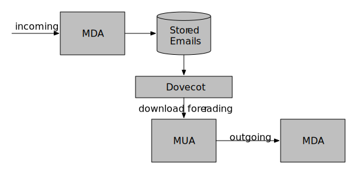

== Introduction: 

In this book we talk about
OpenBSD, The Internet as a Threat Landscape, Email,
and OpenBSD as the best email server for the internet
(and the best email server software for OpenBSD).

=== About OpenBSD

OpenBSD is an operating system derived from Unix.
"Open" has been around for two decades, after splitting off from another BSD project.
BSD in turn is Berkeley Software Distribution or "Berkeley Unix", UC
Berkeley's expanded (but now discontinued) version of the One True Unix.
Unix was developed at AT&T Bell Labs Research Center; its history is told elsewhere, and goes all the way back to 1970.

=== The Internet as a Threat Landscape

The Internet was developed over many years, starting with the ARPAnet which connected
a few university and military sites. ARPAnet was originated in an open environment but
with access limited to known researchers,
so security was not a primary consideration.
At the same time, desktop computing evolved in a commercial, "Buy Windows for $100" scheme
which, again, was not as security-focused as it should have been.
Ever since then we have been playing catch-up on security.

Today new threats emerge constantly due to black-hat hackers, "bad actors",
who either find a thrill in destroying the work of others,
or who think it fair to get rich by stealing from others.
There are gazillions of people using the internet, so a thief only needs to 
pick a small percentage of pockets to be able to steal a decent living.
Frequently, white-hat security researchers find vulnerabilities in software
(and, increasingly, in hardware) and black-hats find ways to actually exploit these.
The problems are compounded by the slow speed at which some software companies release updates,
and by the fact that many users rarely if ever update their software.

=== OpenBSD as the best Server Platform for a hostile Internet

OpenBSD's motto is "A secure OS for an insecure internet".
The project focuses on security via several points:

* code correctness as a way of providing security.
* design security in from the start
* integrate security features into the kernel

OpenBSD typically releases updates as quickly as possible when new threats emerge,
and users are encouraged to stay up-to-date.
There are two branches of releases, stable and current.
Stable systems stay on a major release, like 6.8, until the next major release comes out, say 6.9.
The _syspatch_ utility allows them to apply security and reliability updates in between releases.
Current distributions are made almost daily, and the _sysupgrade_ utility will install the latest
(this tool is also used to move from one stable release to the next).

=== Internet Email

As you probably know, there are two kinds of email systems: Microsoft Outlook, and
everything else. The non-Outlook-based email world consists mainly of three
kinds of software: MTAs, MUAs, and anti-spam/antivirus. 

MTAs (Mail Transfer Agents, also called MDAs or Mail Delivery Agents)
are the programs that transmit and receive email to/from other servers
on the Internet. Common examples include SendMail, PostFix, OpenSMTPD, and
more. An MTA normally speaks SMTP (the "Simple Mail Transfer Protocol") and
is in charge of sending mail out to the internet, receiving incoming emails
from other MTAs elsewhere on the internet, and saving incoming messages to
disk or otherwise making them available so you can read them.

MUAs are the Mail User Agents, which usually run on end-user systems
(desktops, mobile) and use either IMAP ("Internet Mail Access Protocol") or
the older Post Office Protocol (POP) to download messages, from a server
where the MDA has stored them, to the desktop or mobile device where you
read them. MUAs also handle composing emails and sending them up to the mail
server. Well-known desktop MUAs include Thunderbird and Apple Mail; on
Android, GMail and K9 Mail. Web-based MUAs - such as SquirrelMail - either
provide, or run in,  a web server, usually on the same machine as the MDA.
The original GMail works this way, and Outlook has a web face as well.

The third group, anti-spam and anti-virus software, is similar to desktop
anti-virus software, but aimed at cooperating with the MUAs or MDAs, or
both. These aim to prevent malicious messages from wasting your time and
computing resources.

We'll cover one MTA - Dovecot - in detail in this book.
We'll assume your users either have an MUA such as Thunderbird,
or that they want to use a web-based email client.

=== The Best Email Software for OpenBSD

There are a dozen MTAs available in open source for Unix.
OpenSMTPD (also called `smtpd`) is the one that ships
as the default mailer on OpenBSD, so it's the one we use and write about.
OpenSMTPD was developed because the code base of the popular `sendmail`
was almost too large to comprehend, let alone to consider secure.
Its configuration syntax was also almost impossible to comprehend.
Gilles bravely set out to build a working replacement that would
be small, secure, self-contained, and standards-conforming - the four esses
for essential software.

If you have normal desktop users accessing your email server,
you are going to need a way for them to send and receive emails,
using an email client like Thunderbird.
That client will usually download email messages to the 
desktop computer via a network protocol like IMAP
or the older POP.
We'll use a popular mail downloader called DoveCot for this.
Dovecot is not included with OpenBSD but can be installed
trivially from the ports/packages system.

You may also have some users that want to access their email
via a web interface, so we'll cover one way of serving email via the web.

=== About This Book

Some years ago Ian started to build a video-based course on 
OpenBSD administration. That project failed to thrive,
so Wesley suggested a book instead, and this work was born.

We developed it in the open, on github, from where you can
examine the input documents.
If you find a mistake, you can even "fork the repository and
send us a pull request", if you know what that means.

=== Acknowledgements

The sections on mail software types and some of the material
in the Dovecot chapter was previously published by Ian on 
https://blog.learningtree.com/dovecot-now-favorite-unix-linux-imap-mail-download-server[blog.learningtree.com].
and is used with permission.
